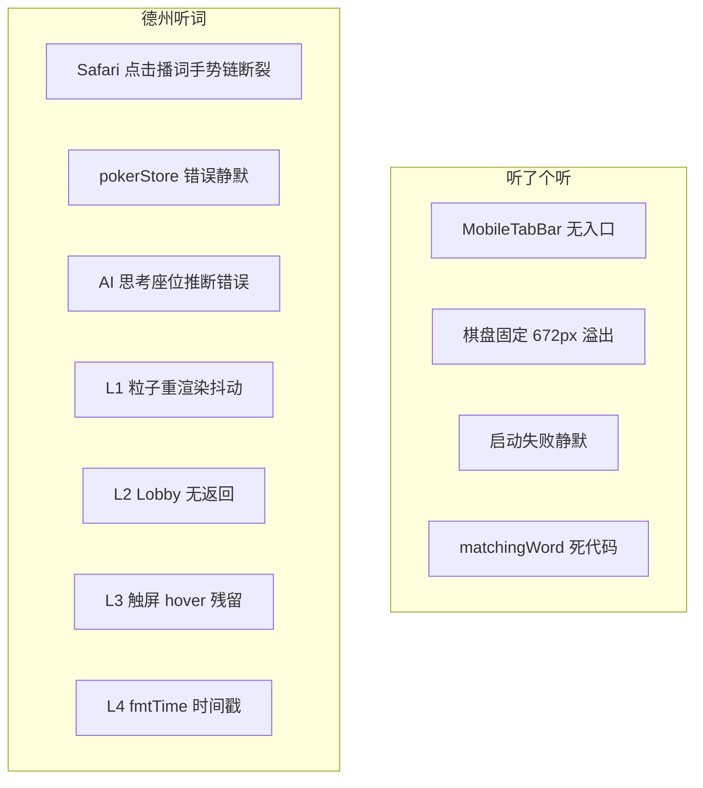

# v0.3.7 Bug 修复计划 — 听了个听 & 德州听词

**日期**: 2026-06-13
**状态**: 已完成 ✅

---

## 1. 文档定位

与 `[product-plan.md](product-plan.md)` 分工：


| 文档                    | 范围                                              |
| --------------------- | ----------------------------------------------- |
| `product-plan.md`     | 沉浸感动效、氛围音效、动画开关                                 |
| `**bug-plan.md`（本文）** | 已确认 Bug 修复、Safari 音频、静默失败、移动端缺口、v0.3.6 遗留 L1–L4 |


两者可并行实施；**Bug 修复（尤其 Safari 音频）优先于 P1/P2 动效装饰**。

---

## 2. Bug 总览




| ID   | 模块               | 优先级 | 状态  |
| ---- | ---------------- | --- | --- |
| B-P1 | Safari 点击播词失败    | P0  | ✅  |
| B-P2 | API 错误静默         | P0  | ✅  |
| B-S1 | 移动端无 game Tab    | P0  | ✅  |
| B-S2 | 棋盘小屏溢出           | P0  | ✅  |
| B-S3 | 游戏启动失败无提示        | P0  | ✅  |
| B-P3 | AI 思考座位错误        | P1  | ✅  |
| B-P4 | 摊牌粒子抖动           | P1  | ✅  |
| B-P5 | Lobby 无返回        | P1  | ✅  |
| B-P6 | 触屏 hover 残留      | P2  | ✅  |
| B-P7 | 历史时间戳            | P2  | ✅  |
| B-S4 | matchingWord 死代码 | P2  | ✅  |


---

## 3. Safari 音频专项（B-P1）

### 3.1 现象

Safari / iOS 下，用户**点击单词 tile 或公共词卡牌**后，经常听不到对应词汇发音。Chrome 通常正常。

影响范围：**听了个听** + **德州听词**（两者均已接入 `usePokerWordAudio`）。

### 3.2 已完成的缓解（不代表 Bug 已关闭）


| 改动               | 文件                                                    | 说明                                         |
| ---------------- | ----------------------------------------------------- | ------------------------------------------ |
| Web Audio API 播放 | `hooks/usePokerWordAudio.ts`                          | 绕过 HTMLAudioElement 切换 `src` 的 Autoplay 限制 |
| 点击同步解锁           | `primeWordAudioContext()`                             | 在用户手势内 resume AudioContext + 播放静音 buffer   |
| 游戏侧接入            | `GameView.tsx`、`poker-table-view.tsx`、`GameModal.tsx` | 均使用 `usePokerWordAudio`                    |
| 统一核心             | `useWordAudio.ts`                                     | 委托 `playWordAudioCore`，WordsView 等入口同源     |
| 德州点击开牌           | `poker-table-view.tsx`                                | 仅 `userRevealed` 点击触发播放，保证有用户手势            |


### 3.3 根因：异步手势链断裂（未根治）

当前点击后的播放链路：

```
用户点击
  → primeWordAudioContext()     ← 同步，在手势内 ✓
  → await getWordSentences()    ← 网络请求，手势链开始断裂
  → await fetch 整课音频
  → await decodeAudioData()
  → source.start()              ← 往往已脱离用户手势 ✗
```

Safari / iOS 要求 AudioContext 在用户手势内解锁；**第一次点击新课程的词**时，下载 + 解码耗时较长，`source.start()` 执行时手势窗口已关闭，导致静默失败（错误被 catch 吞掉，用户无感知）。

**典型表现**：


| 场景                     | 表现                       |
| ---------------------- | ------------------------ |
| 第一次点某个新课程的词            | 最易失败（需完整 fetch + decode） |
| 同一课程第二次点               | 有 AudioBuffer 缓存，通常能播    |
| 找不到句子音频                | 降级 TTS（`speakWord`）      |
| `usePokerWordAudio` 抛错 | TTS 降级                   |
| `useWordAudio` 抛错      | 静默失败（无 TTS）              |


**次要因素**：

1. **双 AudioContext**：`useSoundEffect.ts` 与 `usePokerWordAudio.ts` 各维护独立 context；德州听词点击时先 `sfx('flip')` 再 `playWordAudio()`，iOS 可能只解锁其中一个。
2. **点击 handler 顺序**：`setState` / 音效先于 `primeWordAudioContext()` 时，增加手势窗口损耗（`poker-table-view` 当前顺序：setState → sfx → playWordAudio）。
3. **失败不可见**：播放失败无 toast，用户以为功能损坏。

### 3.4 修复方案

#### 方案 A — 点击时序优化（必做，低成本）

- 所有播词 `onClick` **第一行**同步调用 `primeWordAudioContext()`，再 `setState` / 音效 / 异步播放
- `useSoundEffect` 与 `usePokerWordAudio` **共用同一 AudioContext**（导出 `getSharedAudioContext()`）

#### 方案 B — 预加载（必做，解决首次点击）


| 场景   | 时机            | 动作                                              |
| ---- | ------------- | ----------------------------------------------- |
| 听了个听 | 选难度点「开始」      | 对本局 words 涉及的 lessonId 批量 `ensureAudioBuffer()` |
| 德州听词 | Lobby 点「开始对决」 | 预 decode 本局可能用到的 lesson（或开局后后台 prefetch）        |
| 全局   | 首次进入游戏页       | 任意按钮点击时 prime context                           |


#### 方案 C — 双轨即时反馈（推荐）

```
用户点击
  → primeWordAudioContext()（同步）
  → speakWord(word)（同步 TTS，立即有声音）
  → 后台 fetch + decode
  → 成功后 Web Audio 播放原课音频（可 cancel TTS）
```

保证 Safari 第一次点击**至少听到 TTS**，原课音频加载成功后自动切换。

#### 方案 D — 失败可见（必做）

- `useWordAudio` catch 中同样调用 `speakWord` 或展示 toast
- 连续失败时顶部 banner：「音频加载失败，请检查网络」

### 3.5 变更文件


| 文件                                           | 改动                                          |
| -------------------------------------------- | ------------------------------------------- |
| `hooks/usePokerWordAudio.ts`                 | 共享 context、预加载 API、`playWordAudioCore` 双轨策略 |
| `hooks/useSoundEffect.ts`                    | 改用共享 AudioContext                           |
| `hooks/useWordAudio.ts`                      | catch 增加 TTS / toast                        |
| `views/GameView.tsx`                         | 开局预加载；点击 handler 时序                         |
| `components/game/poker/poker-table-view.tsx` | 点击 handler 时序；可选开局预加载                       |
| `stores/pokerStore.ts`                       | `startGame` 成功后触发预加载                        |


### 3.6 验收标准

1. Safari / iOS：**第一次点击**从未播放过的词的 tile/卡牌，能听到发音（原课音频或 TTS 至少一种）
2. 同一词第二次点击：原课音频正常（缓存命中）
3. 断网点击：有 TTS 或明确错误提示，不静默
4. 德州 flip 音效 + 单词发音可同时正常
5. Chrome 行为不退化

---

## 4. 听了个听 — 其他 Bug

### B-S1 · 移动端无直达入口（P0）

**现象**：MobileTabBar 有 `words`/`poker`，无 `game`，手机无法一键进入听了个听。

**修复**：`MobileTabBar.tsx` 新增 `{ key: 'game', label: '听词', icon: ... }`。

**验收**：375px 宽屏下底部 Tab 可进入 `/game`。

---

### B-S2 · 棋盘在小屏横向溢出（P0）

**现象**：`CELL=84` × 8 列 ≈ 672px，小屏需横向滚动。

**证据**：`GameBoard.tsx`、`GameTile.tsx` 固定 `CELL=84`。

**修复**：按容器宽度动态计算 `cellSize`（下限 ~48px），经 prop 或 CSS 变量 `--game-cell` 共享。

**验收**：iPhone SE 宽度下棋盘完整可见。

---

### B-S3 · 游戏启动失败无任何反馈（P0）

**现象**：选「今日单词」/「待复习」后点开始，API 失败或词数不足时界面无变化。

**证据**：`GameView.tsx` `.catch(() => {})`；`gameStore.initGame` 在 `generateLevel` 返回 null 时静默 return。

**修复**：

- `handleStart` 增加 loading + error banner
- `initGame` 返回成功/失败及原因
- 重玩/刷新传入 `gameSource`：`initGame(words, difficulty, store.gameSource)`

**验收**：三种失败场景均有中文提示。

---

### B-S4 · `matchingWord` 死代码残留（P2）

**现象**：v0.3.1 已原子消除，但 `matchingWord` 字段仍在，道具 guard 冗余。

**修复**：删除字段及所有引用。

---

## 5. 德州听词 — 其他 Bug

### B-P2 · API 错误被静默吞掉（P0）

**现象**：开局/下注/Lobby 加载失败无 UI 反馈。

**证据**：`pokerStore.ts` — `catch { /* ignore */ }`。

**修复**：Store 新增 `error` + `clearError()`；Lobby / Table 展示 dismissible error banner。

---

### B-P3 · AI 思考高亮座位错误（P1）

**现象**：前端用 `total_bet` 最低 AI 推断思考者，经常高亮错误座位。

**修复（推荐）**：后端 `_build_state()` 增加 `acting_player_id`；前端按 id 匹配。

**降级**：思考期间不高亮具体座位，仅保留「AI 思考中」文案。

---

### B-P4 · 摊牌粒子重渲染抖动（P1，v0.3.6 L1）

**现象**：`showdown-result.tsx` 内联 `Math.random()`，重渲染时粒子跳动。

**修复**：mount 时用 `useMemo` 固定 40 个粒子 seed。

---

### B-P5 · Lobby 移动端无退出路径（P1，v0.3.6 L2）

**现象**：v0.3.6 移除 Lobby 返回按钮，Mobile 只能靠 TabBar 切走。

**修复**：`PokerLobby` 恢复左上角返回按钮。

---

### B-P6 · 筹码按钮触屏 hover 残留（P2，v0.3.6 L3）

**现象**：`hover:` 类在触屏点击后样式粘滞。

**修复**：限制为 `@media (hover: hover)` 或 Tailwind 等价写法。

---

### B-P7 · 历史时间显示错误（P2，v0.3.6 L4）

**现象**：`fmtTime(ts * 1000)` 假定秒级时间戳。

**修复**：

```typescript
function fmtTime(ts: number) {
  const ms = ts > 1e12 ? ts : ts * 1000;
  return new Date(ms).toLocaleString('zh-CN', { month: '2-digit', day: '2-digit', hour: '2-digit', minute: '2-digit' });
}
```

---

## 6. 实施顺序


| 阶段          | 任务                                               | 预估     |
| ----------- | ------------------------------------------------ | ------ |
| **Phase 1** | B-P1 Safari 音频（A+B+C+D）+ B-P2 错误提示 + B-S3 启动失败提示 | 1 天    |
| **Phase 2** | B-S1 Tab 入口 + B-S2 棋盘响应式                         | 0.5 天  |
| **Phase 3** | B-P3 AI 座位 + B-P4 粒子 + B-P5 Lobby 返回             | 0.5 天  |
| **Phase 4** | B-P6 hover + B-P7 fmtTime + B-S4 死代码清理           | 0.25 天 |


**总计**：约 2.25 天（Safari 音频 Phase 1 权重提高）。

---

## 7. 变更文件清单


| 文件                                           | Bug ID           |
| -------------------------------------------- | ---------------- |
| `hooks/usePokerWordAudio.ts`                 | B-P1             |
| `hooks/useSoundEffect.ts`                    | B-P1             |
| `hooks/useWordAudio.ts`                      | B-P1             |
| `views/GameView.tsx`                         | B-P1, B-S3       |
| `components/game/poker/poker-table-view.tsx` | B-P1, B-P3, B-P6 |
| `stores/pokerStore.ts`                       | B-P1, B-P2       |
| `components/MobileTabBar.tsx`                | B-S1             |
| `components/game/GameBoard.tsx`              | B-S2             |
| `components/game/GameTile.tsx`               | B-S2             |
| `stores/gameStore.ts`                        | B-S3, B-S4       |
| `components/game/poker/poker-lobby.tsx`      | B-P2, B-P5, B-P7 |
| `components/game/poker/showdown-result.tsx`  | B-P4             |
| `backend/app/services/poker_service.py`      | B-P3（可选）         |


---

## 8. 验收标准（Bug 专项）

1. Safari / iOS：第一次点击新词可听到发音（原课或 TTS）
2. 听了个听：小屏无横向溢出；MobileTabBar 可直达
3. 两个游戏：API / 词数 / 余额失败均有中文提示
4. AI 思考高亮准确（或降级为不高亮错误座位）
5. 摊牌粒子稳定；Lobby 可返回；历史时间正确
6. TypeScript `tsc --noEmit` 零错误
7. 完成后在 `review-report.md` 记录 Bug 修复项

---

## 9. 明确不在 Bug Plan 范围

以下属 **product-plan 功能增强**，不计入本文：

- 入场 / 摊牌 / 筹码飞入等新增动效
- 环境音效层、动画开关 localStorage
- 游戏统计展示页、消除飞行动效
- `can_play >= 1` vs 文档 `>= 3` 的产品规则差异（需产品决策）

---

## 10. 与 product-plan 的交叉引用


| product-plan 章节     | bug-plan 对应                       |
| ------------------- | --------------------------------- |
| §3.7 Safari 音频兼容性修复 | **本文 §3（B-P1）** — 补充根因分析与双轨/预加载方案 |
| §3.3 AI 思考动画        | B-P3 座位推断准确性                      |
| v0.3.6 review L1–L4 | B-P4 ~ B-P7                       |


---

## 11. 实施清单（逐步执行）

> 以下为实现细节，按 Phase 顺序可直接对照改代码。完成后将 §2 状态表全部标为 ✅，并更新 `review-report.md`。

### Phase 1 — Safari 音频 + 错误提示

#### `hooks/usePokerWordAudio.ts`

- 导出 `getSharedAudioContext()`、`speakWord()`、`preloadWordsAudio(words: string[])`
- `ensureAudioBuffer` 加 `preloadInFlight` 去重
- `playWordAudioCore(word, { padding?, immediateTts? })`：
  - 默认 `immediateTts: true` → 先 `speakWord(word)`
  - 原课音频 `source.start()` 前 `speechSynthesis.cancel()`

#### `hooks/useSoundEffect.ts`

- 删除本地 `_audioCtx`，改用 `getSharedAudioContext()` + `primeWordAudioContext()`

#### `hooks/useWordAudio.ts`

- catch 中调用 `speakWord(word)`（不再静默）

#### `views/GameView.tsx`

- `handleTileClick`：`primeWordAudioContext()` → `playWordAudio` → `clickTile`
- `handleStart`：加 `starting` / `startError` state；API catch 提示「加载失败」；`initGame` 失败提示「单词不足」
- 开局成功后 `void preloadWordsAudio(config.words)`
- 重玩/刷新传入 `store.gameSource`

#### `stores/gameStore.ts`

- `initGame` 返回 `boolean`；失败时 `startError` 可选（或由 GameView 本地 state 处理）
- 删除 `matchingWord` 字段及道具 guard（B-S4，可 Phase 4）

#### `stores/pokerStore.ts`

- 新增 `error: string | null`、`clearError()`
- catch 设置中文错误；`startGame` 成功后对 `community_words` 中已有词调用 `preloadWordsAudio`

#### `components/game/poker/poker-table-view.tsx`

- 开牌 onClick：`primeWordAudioContext()` → `playWordAudio` → `setUserRevealed` → `sfx('flip')`
- 顶部 error banner（读 store.error）
- 筹码按钮 class 改 `poker-chip-btn`（Phase 4 CSS）

### Phase 2 — 移动端

#### `components/MobileTabBar.tsx`

- 新增 `{ key: 'game', label: '消除', icon: HiPuzzlePiece }`（放在 `words` 与 `poker` 之间）

#### `components/game/GameBoard.tsx` + `GameTile.tsx`

- `ResizeObserver` 按容器宽度计算 `cellSize = clamp(48, 84)`
- `GameTile` 接收 `cellSize` prop

### Phase 3 — 德州 UX

#### `backend/app/services/poker_service.py` + `lib/api.ts`

- `get_game_state` 返回 `acting_player_id`：当前轮首个未行动的非弃牌玩家 id
- `PokerGameState` 类型增加 `acting_player_id: number | null`

#### `poker-table-view.tsx`

- `thinkingSeatIndex` 按 `game.acting_player_id` 匹配；`betting` 期间不高亮错误座位

#### `showdown-result.tsx`

- mount 时 `useMemo` 固定 40 个粒子 `{ left, top, dx, dy }`

#### `poker-lobby.tsx`

- 恢复左上角返回按钮（`onBack` prop，由 `PokerGameView` 传入 `navigate(-1)`）

### Phase 4 — 收尾

#### `index.css`

```css
@media (hover: hover) {
  .poker-chip-btn:hover { color: rgba(255,255,255,0.7); background: rgba(255,255,255,0.1); }
}
```

#### `poker-lobby.tsx` — `fmtTime`

```typescript
const ms = ts > 1e12 ? ts : ts * 1000;
```

#### 验证

```bash
cd frontend && npx tsc --noEmit
```

